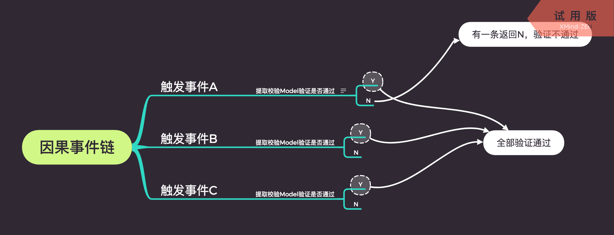

# 2018-08-30

### 因果事件校验模型

传统的交互逻辑校验一般使用Validate对象，内置了一些业务规则逻辑，开发者使用IFFE模式根据实际业务场景，业务逻辑层层判断后，单独返回验证结果来处理；当项目复杂度上升时，整个校验链条会变的杂乱无序，基于数据驱动框架（Vue，React）等的数据状态流会变得无法追溯每个对象改变后发生的关联事件；


案例：
```js

// 校验表单
validForm(type) {
    let self = this
    self.validResult = true
    if (self.validResult) {
        self.validRelation(type)
    }
    if (self.validResult) {
        self.validHolderSex(type)
    }
    if (self.validResult) {
        self.validName(type)
    }
    if (self.validResult) {
        self.validCertiType(type)
    }
    if (self.validResult) {
        self.validCertiNo(type)
    }
    if (self.validResult) {
        self.validBirth(type)
    }
    if (self.validResult) {
        self.validSex(type)
    }
    if (self.validResult) {
        self.validPhone(type)
    }
    if (self.actInsureNeed.social && self.validResult) {
        self.validMedicare(type)
    }
    return {
        validResult: self.validResult,
        index: self.actInsureMember
    }
},
// ...
// relation
validRelation(type) {
    let self = this
    let toastType = type || 'normal'
    let validResult = false
    validResult = self.validResult
    if (toastType === 'noToast') {
        validResult = true
    }
    if (!validResult) {
        return
    }
    validResult = inUtils.validRequired(self.formatUserInfo.relation)
    if (!validResult) {
        if (toastType !== 'noToast') {
            this.$zaToast(this.formatTip() + '请选择' + self.validWord + '为谁投保')
        }
    }
    // console.log(this.$refs['insureUserName'])
    self.validResult = validResult
    return validResult
},
// name
validName(type) {    // type == normal 暂时只提供给自动同步出生年月和性别，以及本人类型
    let self = this
    let toastType = type || 'normal'
    let validResult = false
    validResult = self.validResult
    if (toastType === 'noToast') {
        validResult = true
    }
    if (!validResult) {
        return
    }
    validResult = inUtils.validName(self.formatUserInfo.insureUserName)
    if (!validResult) {
        if (toastType !== 'noToast') {
        this.$zaToast(this.formatTip() + '请输入' + self.validWord + '被保人姓名')
        }
    }
    // console.log(this.$refs['insureUserName'])
    self.validResult = validResult
    return validResult
},
```

问题：

#### 什么是因果，事件理论

// TODO

### 因果事件链



#### 校验Model：
- SchemaJson逻辑对象，封装了统一的Validate规则，通过传入相关匹配参数来做逻辑验证，理论上每一个事件链条的因果关系中，都要配置一个Model，简化整体复杂交互关联业务中的验证模型。

#### 校验器：
- Validator校验逻辑规则函数工具，提供相关的校验事件API，规则API等

#### 因果事件链
- 基于实际业务逻辑关系，建立一个事件条件下，所有需要处理的因果关系，根据每个因果的返回值（Y／N），汇总所有事件的（真／假）结果集，得出该事件的因果结论


